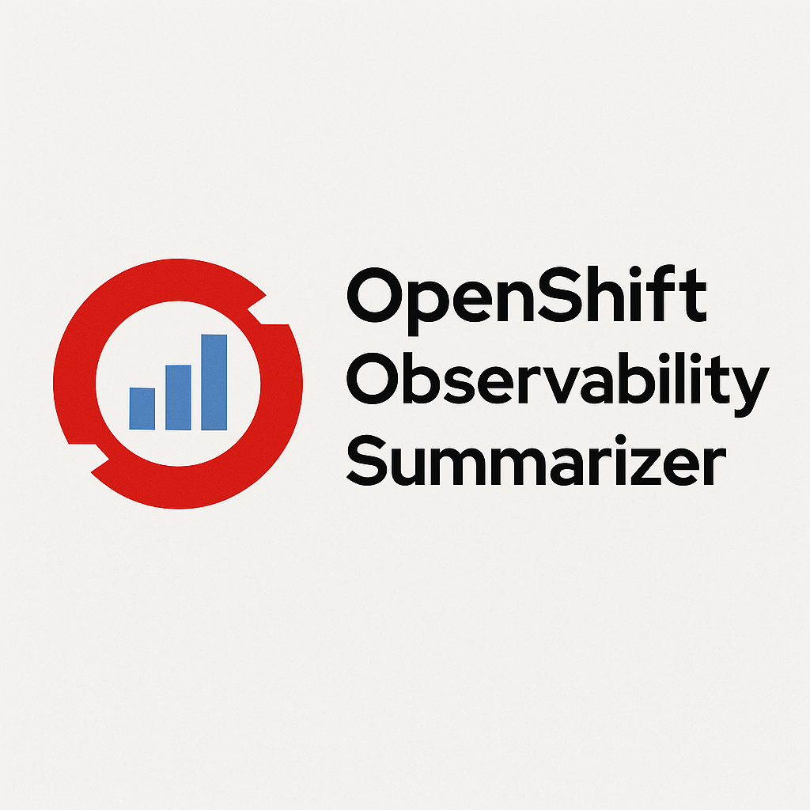
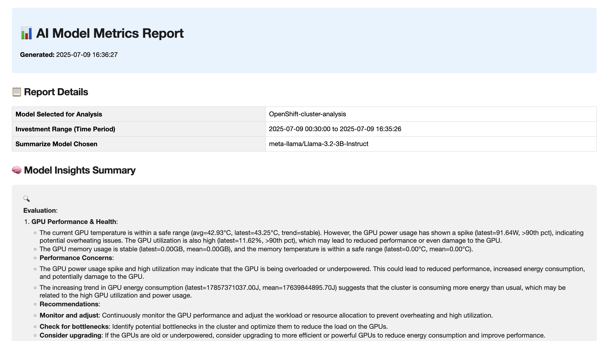

# OpenShift AI Observability Summarizer

[](https://www.cncf.io/)
[](LICENSE)
[](https://github.com/rh-ai-kickstart/openshift-ai-observability-summarizer/actions)





[Design Document](https://docs.google.com/document/d/1bXBCL4fbPlRqQxwhGX1p12CS_E6-9oOyFnYSpbQskyI/edit?usp=sharing)

## Overview

OpenShift AI Observability Summarizer is an **open source, CNCF-style project** for advanced monitoring and automated summarization of AI model and OpenShift cluster metrics. It provides an interactive dashboard for analyzing metrics collected from Prometheus and generating human-readable, AI-powered insights and reports.

- **Monitors vLLM deployments, OpenShift fleet health, and GPU utilization**
- **Generates actionable summaries using LLMs**
- **Supports alerting, notifications, and exportable reports**

---

## Table of Contents

- [Features](#features)
- [GPU Monitoring](#gpu-monitoring)
- [Architecture](#architecture)
- [Getting Started](#getting-started)
- [Usage](#usage)
- [Build & Deploy](#build--deploy)
- [Local Development](#local-development-via-port-forwarding)
- [Running Tests with Pytest](#running-tests-with-pytest)
- [GitHub Actions CI/CD](#github-actions-cicd)
- [Semantic Versioning](#semantic-versioning)
- [Helm Charts Documentation](#helm-charts-documentation)
- [Contributing](#contributing)
- [Community](#community)
- [License](#license)

---


## Features

### **1. vLLM Monitoring**
- Visualize core vLLM metrics (GPU usage, latency, request volume, etc.)
- Dynamic DCGM GPU metrics discovery (temperature, power, memory)
- Real-time performance analysis and anomaly detection

### **2. OpenShift Fleet Monitoring** 
- Cluster-wide and namespace-scoped metric analysis
- GPU & Accelerators fleet monitoring with comprehensive DCGM metrics
- Workloads, Storage, Networking, and Application Services monitoring
- Enhanced unit formatting (°C, Watts, GB, MB/s, etc.)

### **3. AI-Powered Insights**
- Generate summaries using fine-tuned Llama models
- Chat with an MLOps assistant based on real metrics
- Support for both internal and external LLM models

### **4. Report Generation**
- Export analysis as HTML, PDF, or Markdown reports
- Time-series charts and metric visualizations
- Automated metric calculations and trend analysis

### **5. Alerting & Notifications**
- Set up alerts for vLLM models and OpenShift metrics  
- Slack notifications when alerts are triggered
- Custom alert thresholds and conditions

### **6. Distributed Tracing Integration**
- **Complete Observability Stack**: MinIO storage + TempoStack + OpenTelemetry Collector + auto-instrumentation
- **Tracing support** with OpenTelemetry and Tempo to monitor request flows across your AI services
- **Flexible deployment**: Install complete stack or individual components as needed

### **7. AI Assistant Integration (MCP Server)**
- **Model Context Protocol (MCP) server** for AI assistants (Claude Desktop, Cursor IDE)
- **Natural language analysis** - ask questions like "What is the GPU temperature?"
- **Real-time data access** - connects directly to Prometheus/Thanos
- **AI-powered insights** - full LLM integration for intelligent metric analysis

Supports stdio and HTTP (SSE) transports. See `src/mcp_server/README.md` for configuration examples.

📖 **Quick Setup**: 
```bash
cd src/mcp_server && python setup_integration.py
```
See [`src/mcp_server/README.md`](src/mcp_server/README.md) for complete documentation.

### **8. 🤖 Chat with Prometheus - Claude Desktop Intelligence**
- **Claude Desktop-style interface** with autonomous tool calling and real-time progress visibility
- **Dynamic metric selection** from 3500+ available metrics using AI-powered analysis  
- **Intelligent PromQL generation** with automatic aggregation and filtering
- **Rich contextual responses** including operational insights, health assessments, and technical details
- **Multi-iteration analysis** - Claude uses multiple tools sequentially for comprehensive understanding

Ask questions like: *"How many pods are running?"*, *"What's the GPU temperature?"*, *"Token generation rate?"* and get Claude Desktop-quality responses with full transparency of the AI reasoning process.

---

### GPU Monitoring

### **DCGM Metrics Support**
Automatically discovers and monitors:
- **Temperature**: GPU core and memory temperature (°C)
- **Power**: Real-time power consumption (Watts)  
- **Memory**: GPU memory usage (GB) and utilization (%)
- **Energy**: Total energy consumption (Joules)
- **Performance**: GPU utilization, clock speeds (MHz)

### **Fleet View**
Monitor GPU health across your entire OpenShift cluster:
- Cluster-wide GPU temperature averaging
- Power consumption trends
- Memory usage patterns
- Vendor/model detection and inventory

---

## Architecture


### **Core Components**
- **Prometheus/Thanos**: Metrics collection and long-term storage
- **vLLM**: Model serving with /metrics endpoint
- **DCGM**: GPU monitoring and telemetry
- **Streamlit UI**: Multi-dashboard interface (vLLM, OpenShift, Chat)
- **FastAPI Backend**: metrics-api for web UI and report generation
- **MCP Server**: Model Context Protocol server for AI assistant integration
- **LLM Stack**: Llama models for AI-powered insights and summaries

### **Key Features**
1. **vLLM Dashboard**: Monitor model performance, GPU usage, latency
2. **OpenShift Dashboard**: Fleet monitoring with cluster-wide and namespace views
3. **Chat Interface**: Interactive Q&A with metrics-aware AI assistant
4. **MCP Server**: AI assistant integration via Model Context Protocol
5. **Report Generator**: Automated analysis reports in multiple formats

---

## Getting Started

### Prerequisites

- OpenShift cluster with GPU nodes (for DCGM metrics)
- `oc` CLI with cluster-admin permissions
- `helm` v3.x
- `yq` (YAML processor)
- Deployed Prometheus/Thanos
- Operators for distributed tracing
  - Red Hat Build of OpenTelemetry Operator
  - Tempo Operator
  - Cluster Observability Operator
- (Optional) DCGM exporter for GPU monitoring
- (Optional) Slack Webhook URL for alerting ([How to create a Webhook for your Slack Workspace](https://api.slack.com/messaging/webhooks))


### Installing the OpenShift AI Observability Summarizer

Use the included `Makefile` to install everything:
```bash
make install NAMESPACE=your-namespace
```
This will install the project with the default LLM deployment, `llama-3-2-3b-instruct`.

### Using an Existing Model

To use an existing model instead of deploying a new one, specify `LLM_URL` as the model service URL:

```bash
# URL with port (no processing applied)
make install LLM_URL=http://llama-3-2-3b-instruct-predictor.dev.svc.cluster.local:8080/v1 NAMESPACE=your-namespace

# URL without port (automatically adds :8080/v1)
make install LLM_URL=http://llama-3-2-3b-instruct-predictor.dev.svc.cluster.local NAMESPACE=your-namespace
```

**URL Processing**: If the `LLM_URL` doesn't contain a port (`:PORT` format), the system will automatically append `:8080/v1` to the URL. This simplifies configuration while maintaining flexibility for custom ports.

**Token Management**: When `LLM_URL` is specified, the system will not prompt for a Hugging Face token since you're using an existing model that doesn't require new model deployment.

This is useful when:
- You already have a model deployed in your cluster
- You want to share a model across multiple namespaces
- You prefer not to deploy redundant model instances
- You want to avoid unnecessary token prompts for external models

### Choosing different models

To see all available models:
```bash
make list-models
```
```
(Output)
model: llama-3-1-8b-instruct (meta-llama/Llama-3.1-8B-Instruct)
model: llama-3-2-1b-instruct (meta-llama/Llama-3.2-1B-Instruct)
model: llama-3-2-1b-instruct-quantized (RedHatAI/Llama-3.2-1B-Instruct-quantized.w8a8)
model: llama-3-2-3b-instruct (meta-llama/Llama-3.2-3B-Instruct)
model: llama-3-3-70b-instruct (meta-llama/Llama-3.3-70B-Instruct)
model: llama-guard-3-1b (meta-llama/Llama-Guard-3-1B)
model: llama-guard-3-8b (meta-llama/Llama-Guard-3-8B)
```
You can use the `LLM` flag during installation to set a model from this list for deployment:
```
make install NAMESPACE=your-namespace LLM=llama-3-2-3b-instruct 
```

### With GPU tolerations
```bash
make install NAMESPACE=your-namespace LLM=llama-3-2-3b-instruct LLM_TOLERATION="nvidia.com/gpu"
```

### With safety models
```bash
make install NAMESPACE=your-namespace \
  LLM=llama-3-2-3b-instruct LLM_TOLERATION="nvidia.com/gpu" \
  SAFETY=llama-guard-3-8b SAFETY_TOLERATION="nvidia.com/gpu"
```

### With alerting
```bash
make install NAMESPACE=your-namespace ALERTS=TRUE
```
Enabling alerting will deploy alert rules, a cron job to monitor vLLM metrics, and AI-powered Slack notifications.

### Observability Stack Management

The project includes a complete observability stack with flexible deployment options:

#### **Complete Stack Installation**
```bash
# Install complete observability stack (MinIO + TempoStack + OTEL + tracing)
# Note: NAMESPACE is required for tracing setup
make install-observability-stack NAMESPACE=your-namespace

# Uninstall complete observability stack
# Note: NAMESPACE is required for tracing removal
make uninstall-observability-stack NAMESPACE=your-namespace
```

#### **Individual Component Management**
```bash
# Install individual components
make install-minio                                           # MinIO storage only (uses observability-hub namespace)
make install-observability                                   # TempoStack + OTEL only (uses observability-hub namespace)
make setup-tracing NAMESPACE=your-namespace                 # Auto-instrumentation only (requires NAMESPACE)

# Uninstall individual components
make uninstall-minio                                         # MinIO storage only (uses observability-hub namespace)
make uninstall-observability                                 # TempoStack + OTEL only (uses observability-hub namespace)
make remove-tracing NAMESPACE=your-namespace                 # Auto-instrumentation only (requires NAMESPACE)
```

#### **NAMESPACE Requirements**
- **Complete Stack**: `install-observability-stack` and `uninstall-observability-stack` require NAMESPACE for tracing components
- **Storage & Core**: `install-minio`, `uninstall-minio`, `install-observability`, `uninstall-observability` use hardcoded `observability-hub` namespace
- **Tracing Only**: `setup-tracing` and `remove-tracing` require NAMESPACE parameter

#### **Observability Features**
- **MinIO**: S3-compatible object storage for trace data and log data
- **TempoStack**: Multitenant trace storage and analysis
- **OpenTelemetry Collector**: Distributed tracing collection
- **Auto-instrumentation**: Automatic Python application tracing

### Accessing the Application

The default configuration deploys:
- **llm-service** - LLM inference
- **llama-stack** - Backend API
- **pgvector** - Vector database
- **metrics-api** - Metrics collection & processing API
- **metric-ui** - Multi-dashboard Streamlit interface
- **mcp-server** - Model Context Protocol server for AI assistants
- **OpenTelemetry Collector** - Distributed tracing collection
- **Tempo** - Trace storage and analysis
- **MinIO** - Object storage for traces

Navigate to your **OpenShift Cluster → Networking → Routes** to find the application URL(s). You can also navigate to **Observe → Traces** in the OpenShift console to view traces.

On terminal you can access the route with:

```bash
oc get route

NAME              HOST/PORT                                                               PATH   SERVICES        PORT   TERMINATION     WILDCARD
metric-ui-route   metric-ui-route-llama-1.apps.tsisodia-spark.2vn8.p1.openshiftapps.com          metric-ui-svc   8501   edge/Redirect   None
```

### OpenShift Summarizer Dashboard 


### vLLM Summarizer Dashboard 


### Chat with Prometheus 


### Report Generated 



To uninstall:

```bash
make uninstall NAMESPACE=your-namespace
```

---

## Usage

### **Multi-Dashboard Interface**
Access via the OpenShift route: `oc get route`

#### **vLLM Metric Summarizer**
1. Select your AI model and namespace
2. Choose time range for analysis  
3. Click **Analyze Metrics** for AI-powered insights
4. Download reports in HTML/PDF/Markdown format

#### **OpenShift Metrics Dashboard**
1. Choose metric category (Fleet Overview, GPU & Accelerators, etc.)
2. Select scope: Cluster-wide or Namespace-scoped
3. Analyze performance with AI-generated summaries
4. Monitor GPU temperature, power usage, and utilization across fleet

#### **Chat with Prometheus**
1. Ask natural language questions about your metrics
2. Get specific PromQL queries and insights
3. Interactive troubleshooting with metrics context

#### **Key Monitoring Categories**
- **Fleet Overview**: Pods, CPU, Memory, GPU temperature
- **GPU & Accelerators**: Temperature, power, utilization, memory (GB)  
- **Workloads & Pods**: Container metrics, restarts, failures
- **Storage & Networking**: I/O rates, network throughput
- **Application Services**: HTTP metrics, endpoints, errors

#### Generate Reports
You can generate detailed metric reports in multiple formats directly from the dashboard:

- **HTML Report**: Interactive and visually rich, suitable for sharing or archiving.
- **PDF Report**: Print-ready, ideal for documentation or compliance needs.
- **Markdown Report**: Lightweight, easy to edit or integrate into wikis and documentation.

To generate a report:
1. Complete your analysis in either the vLLM or OpenShift dashboard.
2. Click the **Download Report** button.
3. Choose your preferred format (HTML, PDF, or Markdown).
4. The report will be generated and downloaded automatically, containing charts, summaries, and key insights from your session.

---

## Build & Deploy

The project includes a comprehensive Makefile that simplifies building, pushing, and deploying the application components.

### Building and Pushing Container Images

The application consists of multiple services that need to be built as container images for OpenShift deployment.

```bash
# Build all container images
make build

# Build with custom version
make build VERSION=v1.0.0

# Build individual components
make build-metrics-api    # FastAPI Backend
make build-ui            # Streamlit UI  
make build-alerting      # Alerting Service
make build-mcp-server    # MCP Server
```

#### **Push Images to Registry**

```bash
# Push all images to registry
make push

# Push with custom version
make push VERSION=v1.0.0

# Push individual components
make push-metrics-api
make push-ui
make push-alerting
```

#### **Complete Build and Push Workflow**

```bash
# Build and push all images in one command
make build-and-push

# With custom configuration
make build-and-push VERSION=v1.0.0 REGISTRY=your-registry.com/your-org
```

### Deploy to OpenShift

#### **Basic Deployment**

```bash
# Deploy to OpenShift namespace
make deploy NAMESPACE=your-namespace

# Deploy with alerting enabled
make deploy-with-alerts NAMESPACE=your-namespace
```

#### **Complete Build, Push, and Deploy Workflow**

```bash
# Complete workflow: build → push → deploy
make build-deploy NAMESPACE=your-namespace

# Complete workflow with alerting
make build-deploy-alerts NAMESPACE=your-namespace
```

#### **Deployment Management**

```bash
# Check deployment status
make status NAMESPACE=your-namespace

# Uninstall deployment
make uninstall NAMESPACE=your-namespace
```

### Configuration Options

The Makefile supports various configuration options via environment variables:

```bash
# Set custom registry
export REGISTRY=your-registry.com/your-org

# Set custom version
export VERSION=v1.0.0

# Set target platform
export PLATFORM=linux/amd64

# Show current configuration
make config
```

### Available Models

See [Choosing different models](#choosing-different-models) section for the complete list of available models.

### Cleanup

```bash
# Clean up local images
make clean
```

## Local Development via Port-Forwarding

For local development of the metrics API/UI and MCP server, use the unified development environment script that handles port-forwarding to Llamastack, LLM service, and Thanos.

**Pre-requisites**:
1. You have a deployment on the cluster already.
2. You are logged into the cluster and can execute `oc` commands against the cluster.

### Quick Setup with Makefile

The easiest way to set up local development is using the Makefile:

```bash
# Set up local development environment
make install-local NAMESPACE=your-namespace
```

This will run the `./scripts/local-dev.sh` script automatically.

### Manual Setup

If you prefer to run the script manually, follow these steps:

1. **Make sure you are logged into the cluster and can execute `oc` commands against the cluster.**
2. Install `uv` by following instructions on the [uv website](https://github.com/astral-sh/uv)
3. Sync up the environment and development dependencies using `uv` in the base directory

### Quick Start
```bash
# 1. Setup environment
uv sync --group dev
# Note: Virtual environment activation is handled automatically by the script

# 2. Start development environment (includes all port forwarding)
./scripts/local-dev.sh -n <DEFAULT_NAMESPACE>

# 3. If model is in different namespace (optional)
./scripts/local-dev.sh -n <DEFAULT_NAMESPACE> -m <MODEL_NAMESPACE>

# 4. For different log levels (optional)
PYTHON_LOG_LEVEL=DEBUG ./scripts/local-dev.sh -n <DEFAULT_NAMESPACE>   # Debug logs
PYTHON_LOG_LEVEL=WARN ./scripts/local-dev.sh -n <DEFAULT_NAMESPACE>    # Warning only
```

### What the script does:
- ✅ **Activates Python virtual environment** (.venv)
- ✅ **Port forwards Prometheus/Thanos** (localhost:9090)
- ✅ **Port forwards LLM server** (localhost:8321)
- ✅ **Port forwards Model service** (localhost:8080)
- ✅ **Starts metrics API** (localhost:8000)
- ✅ **Starts Streamlit UI** (localhost:8501)
- ✅ **Configures environment** for MCP server development
- ✅ **Sets configurable logging** (PYTHON_LOG_LEVEL=INFO by default, override with env var)

### For MCP/AI Assistant Development
After running `scripts/local-dev.sh`, you can:

```bash
# Configure AI assistants (Claude Desktop + Cursor IDE)
cd src/mcp_server
python setup_integration.py

# Test MCP server
obs-mcp-server --test-config
```

The output should look like this:


 

## Running Tests with Pytest

The test suite is located in the `tests/` directory, with the tests for each service in their respective directories.

1. Using `uv`, sync up the test dependencies listed in `pyproject.toml`:

```bash
# Create virtual environment
uv sync --group test
```

2. Use the `pytest` command to run all tests

```bash
# Run all tests with verbose output and coverage
uv run pytest -v --cov=src --cov-report=html --cov-report=term

# Run only API tests
uv run pytest -v tests/api/

# Run specific test file
uv run pytest -v tests/api/test_api_endpoints.py
```

To view a detailed coverage report after generating, open `htmlcov/index.html`.

---

## GitHub Actions CI/CD

Automated workflows cover testing, building, deploying, and undeploying. Configure OpenShift and registry secrets, and the pipelines will run on PRs and merges.

📖 See [docs/GITHUB_ACTIONS.md](docs/GITHUB_ACTIONS.md) for full workflow details and setup.

---

## Semantic Versioning

Semantic versions are derived automatically from PR labels/titles, falling back to commit messages.

📖 See [docs/SEMANTIC_VERSIONING.md](docs/SEMANTIC_VERSIONING.md) for complete rules and examples.

---

## Helm Charts Documentation

The project uses Helm charts for OpenShift deployment with centralized image management. Both image repositories and versions are controlled through Makefile variables using Helm's `--set` override functionality:

- **Image repositories**: Controlled via `REGISTRY`, `ORG`, and `IMAGE_PREFIX` variables
- **Image versions**: Controlled via the `VERSION` variable
- **Helm overrides**: `--set image.repository=$(IMAGE_NAME)` and `--set image.tag=$(VERSION)`

📖 **[Complete Helm Charts Documentation](docs/HELM_CHARTS.md)** - Detailed information about Helm chart structure, image management, deployment patterns, and customization options.

### Logging

All services use centralized structured logging. Control verbosity via the `PYTHON_LOG_LEVEL` environment variable (e.g., `INFO`, `DEBUG`). Helm values expose this for `metrics-api`, `ui`, and `mcp-server`.

---

## Contributing

We welcome contributions and feedback! Please open issues or submit PRs to improve this dashboard or expand model compatibility.

See [CONTRIBUTING.md](CONTRIBUTING.md) for full contribution guidelines.

---

## Community

- [GitHub Discussions](https://github.com/rh-ai-kickstart/openshift-ai-observability-summarizer/discussions)
- [CNCF Landscape](https://landscape.cncf.io/)
- [OpenShift AI](https://www.redhat.com/en/technologies/cloud-computing/openshift/openshift-ai)
- [Prometheus](https://prometheus.io/)
- [Streamlit](https://streamlit.io/)

---

## License

Licensed under the [MIT License](LICENSE).

---

