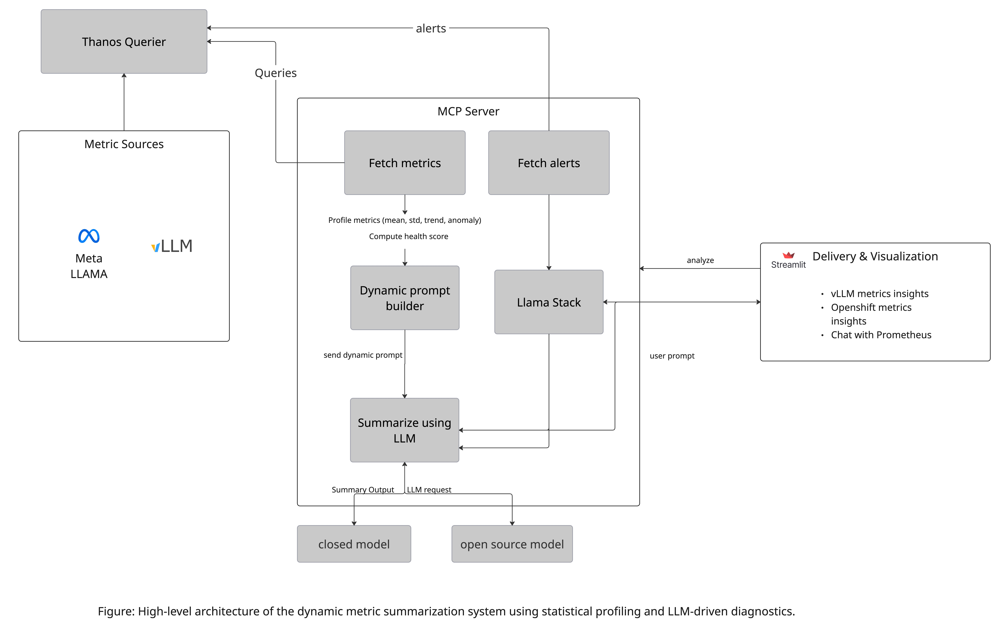
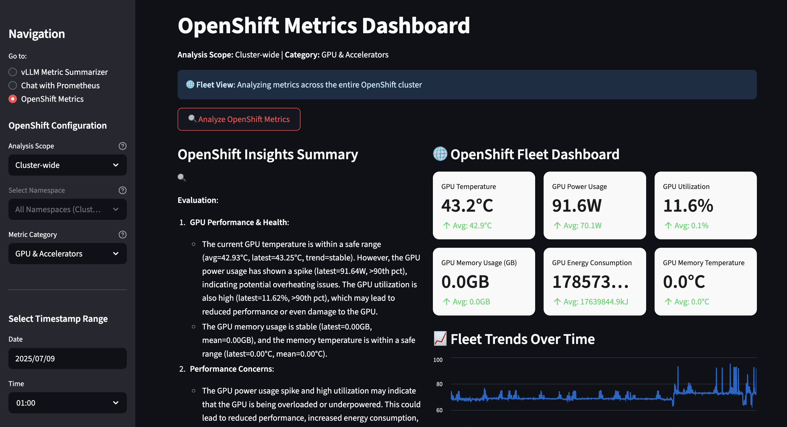
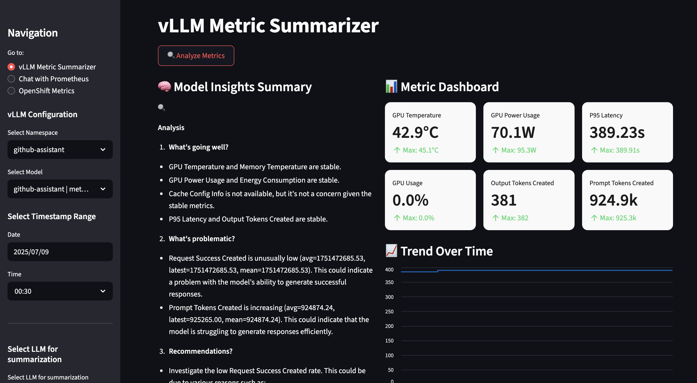
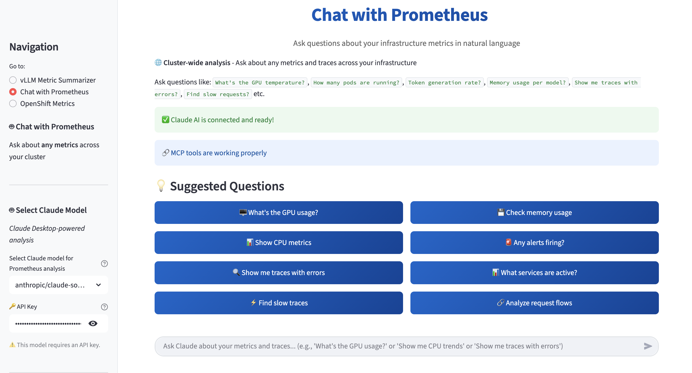

# OpenShift AI Observability Summarizer

**Monitor your AI models the smart way.** Get instant answers about performance, costs, and problems—in plain English, not technical jargon.

Ask questions like "How is my GPU performing?" or "Why is my model slow?" and get clear, actionable insights from your OpenShift AI infrastructure.

## Detailed description

The OpenShift AI Observability Summarizer is an intelligent monitoring platform that transforms complex infrastructure metrics into actionable business insights. Built specifically for OpenShift AI environments, it provides real-time visibility into GPU utilization, model performance, and operational costs through an intuitive conversational interface.

This platform combines advanced AI analysis with comprehensive observability to help organizations optimize their AI infrastructure investments. Instead of drowning in thousands of raw metrics, users can simply ask questions in natural language and receive intelligent, context-aware responses about their AI workloads.

Key capabilities include automated performance analysis, predictive cost optimization, intelligent alerting, and seamless integration with existing OpenShift monitoring infrastructure. The system leverages Llama 3.2-3B for AI-powered insights and supports both real-time monitoring and historical trend analysis.

Perfect for AI operations teams, platform engineers, and business stakeholders who need to understand and optimize their AI infrastructure without becoming metrics experts.

### Architecture diagrams



## Requirements

### Minimum hardware requirements

* 4 cores
* 8 Gi RAM
* Storage: 20Gi

### Recommended hardware requirements

* 8 cores
* 16 Gi RAM
* Storage: 50Gi
* GPU nodes (for DCGM metrics)

### Minimum software requirements

* Red Hat OpenShift 4.16.24 or later
* Red Hat OpenShift AI 2.16.2 or later
* Dependencies for model serving:
  * Red Hat OpenShift Service Mesh
  * Red Hat OpenShift Serverless

### Required user permissions

* Standard user with project admin permissions. No elevated cluster permissions required.

## Deploy

### Installing the OpenShift AI Observability Summarizer

Use the included `Makefile` to install everything:
```bash
make install NAMESPACE=your-namespace
```
This will install the project with the default LLM deployment, `llama-3-2-3b-instruct`.

### Choosing different models during installation

To see all available models:
```bash
make list-models
```
```
(Output)
model: llama-3-1-8b-instruct (meta-llama/Llama-3.1-8B-Instruct)
model: llama-3-2-1b-instruct (meta-llama/Llama-3.2-1B-Instruct)
model: llama-3-2-1b-instruct-quantized (RedHatAI/Llama-3.2-1B-Instruct-quantized.w8a8)
model: llama-3-2-3b-instruct (meta-llama/Llama-3.2-3B-Instruct)
model: llama-3-3-70b-instruct (meta-llama/Llama-3.3-70B-Instruct)
model: llama-guard-3-1b (meta-llama/Llama-Guard-3-1B)
model: llama-guard-3-8b (meta-llama/Llama-Guard-3-8B)
```
You can use the `LLM` flag during installation to set a model from this list for deployment:
```
make install NAMESPACE=your-namespace LLM=llama-3-2-3b-instruct 
```

### With GPU tolerations
```bash
make install NAMESPACE=your-namespace LLM=llama-3-2-3b-instruct LLM_TOLERATION="nvidia.com/gpu"
```

### With alerting if you want to send on SLACK
```bash
make install NAMESPACE=your-namespace ALERTS=TRUE
```
Enabling alerting will deploy alert rules, a cron job to monitor vLLM metrics, and AI-powered Slack notifications.

### Accessing the Application

The default configuration deploys:
- **llm-service** - LLM inference
- **llama-stack** - Backend API
- **metric-ui** - Multi-dashboard Streamlit interface
- **mcp-server** - Model Context Protocol server for metrics analysis, report generation, and AI assistant integration
- **OpenTelemetry Collector** - Distributed tracing collection
- **Tempo** - Trace storage and analysis
- **MinIO** - Object storage for traces

Navigate to your **OpenShift Cluster → Networking → Routes** to find the application URL(s). You can also navigate to **Observe → Traces** in the OpenShift console to view traces.

On terminal you can access the route with:

```bash
oc get route

NAME              HOST/PORT                                                               PATH   SERVICES        PORT   TERMINATION     WILDCARD
metric-ui-route   metric-ui-route-llama-1.apps.tsisodia-spark.2vn8.p1.openshiftapps.com          metric-ui-svc   8501   edge/Redirect   None
```

### OpenShift Summarizer Dashboard 


### vLLM Summarizer Dashboard 


### Chat with Prometheus 


### Report Generated 


### Delete
To uninstall:

```bash
make uninstall NAMESPACE=your-namespace
```

### References

* Refer to [DEVELOPER_INSIGHTS](https://github.com/rh-ai-quickstart/openshift-ai-observability-summarizer/blob/ddaa513143ad92c07df94dd873ed2ea5f87f55d0/DEVELOPER_INSIGHTS.md#:~:text=CONTRIBUTING.md-,DEVELOPER_INSIGHTS,-.md) for more insightful information of this project
* Built on [Prometheus](https://prometheus.io/) and [Thanos](https://thanos.io/) for metrics collection
* Uses [vLLM](https://github.com/vllm-project/vllm) for model serving
* Powered by [Streamlit](https://streamlit.io/) for the web interface
* Integrates with [OpenTelemetry](https://opentelemetry.io/) for distributed tracing

## Tags

* **Industry:** Cross-industry
* **Product:** OpenShift AI
* **Use case:** AI Operations, Observability, Monitoring
